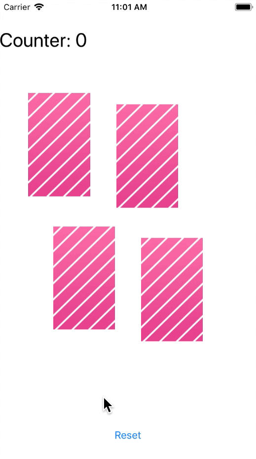

# Assignment 01

In diesem Assignment soll man mit Xcode warm werden und die ersten Schritte wagen.

- Implementiert zwei weitere Karten, welche in einer `Outlet-Collection` verwaltet werden

- Die Tap-Gesture flipped und unflipped die Karten nach wie vor. Allerdings funktioniert die Swipe-Gesture jeweils nur in eine Richtung

  - Swipe nach Rechts macht ein flip
  - Swipe nach Links macht ein unflip

- Zudem wird ein Reset-Button eingeführt, welcher das gesamte Spiel (Karten und Counter) zurücksetzt

  
