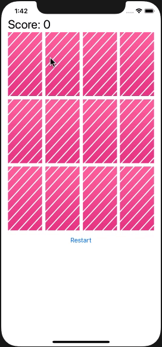

# Assignment 02

In diesem Assignment soll das Zusammenspiel zwischen Model, View und Controller geübt werden

- Es gibt negative Punkte (-3), wenn es keinen Match gegeben hat

- Obwohl es einen Match gegeben hat, sind die Karten weiterhin aktiv (können getapped werden). Um das zu verhindern, sollen erfolgreiche Paare vom Spiel genommen werden, indem bswp. die Benutzerinteraktion verboten wird und die Karten transparent werden

- Wenn das Spiel vorbei ist, kann man es über einen Button neustarten. Hierbei muss der gesamte State des Spiels zurückgesetzt werden

  
