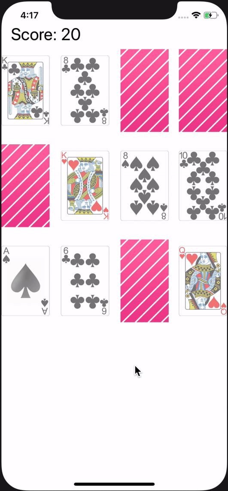

# Assignment 03

In diesem Assignment soll das Zusammenspiel zwischen Model, View und Controller geübt werden

- Jeden Case von `FlippingCardResult` als Delegate-Funktion implementieren und den Unterschied kennenlernen. Was ist an der Stelle besser?
- Das `MatchingCardGame` erkennt ein Game-Over1 und teilt das dem ViewController mit. Der VC reagiert entsprechend darauf und blendet bswp. erst nach einem Game-Over den Restart-Button ein

1Ein Game-Over liegt vor, wenn entweder alle Karten erfolgreich gematched sind oder kein weiterer Match möglich ist

  
