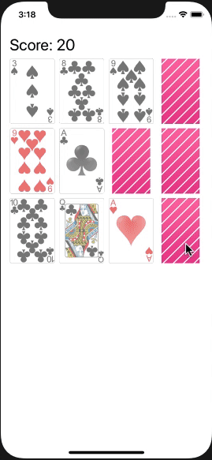

# Assignment 04

In diesem Assignment sollen Animationen hinzugefügt werden. Zudem soll die `CardView` als CustomView ersetzt/verbessert werden

- `FlippingCardResult.alreadySelected` soll eine Animation erhalten (z.B. zittern/wackeln der Karte)

- `GameOver` soll ebenfalls eine Animation erhalten (z.B. indem der Restart-Button beim fade-in hochskaliert)

- *Schwierig*: Die `CardView` ist aktuell nur ein Wrapper um eine ImageView. Es soll experimentiert werden, welche CustomView an dieser Stelle geeigneter ist. Spannend wäre eine `CardView`, welche selsbtständig auf dem Layer gezeichnet wird und damit Custom™️ ist (innerhalb von `override func draw(_:)`)

  
