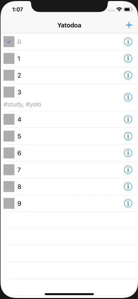
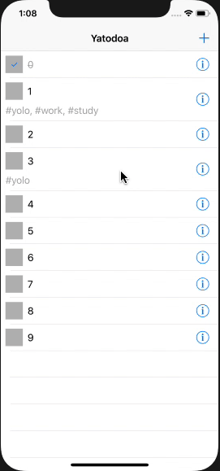

# Assignment 07

In diesem Assignment sollen TableViews geübt werden

## Tags

Todos können mit ein oder mehreren Tags versehen werden

- Dedizierter `TagsTableViewController` mit Auswahl der Tags

- Die Auswahl eines Tags wird mit `cell.accessoryType = .checkmark`  markiert und mit `.none` wieder entfernt

- Falls Tags bereits ausgewählt wurden, werden diese entsprechend vorausgewählt

- Der `DetailViewController` setzt die Tags über `var currentTags: [String]`. Bei zu vielen Tags muss eine geeignete Lösung für die Tag-Cell gefunden werden (Content-Hugging bzw. Content-Compression-Resistance)

- Die `TodoTableViewCell` setzt die Tags über `var tags: [String]`

## Favorisieren

- Todos können mit einem Swipe von Links nach Rechts (`leadingSwipeActions`) favorisiert werden

  - Je nach dem, ob das Todo bereits favorisiert ist oder nicht, wird der entsprechend andere String in der `UIContextualAction` angezeigt

  - Die UI der `TodoTableViewCell` kann frei gewäglt werden. Das in der Musterlösung verwendete Fav-Icon liegt unter dem Namen `fav_icon`  im Assets-Katalog

- Der `TodoViewController`  reagiert nun auch auf das Favorisieren des `DetailViewController`

