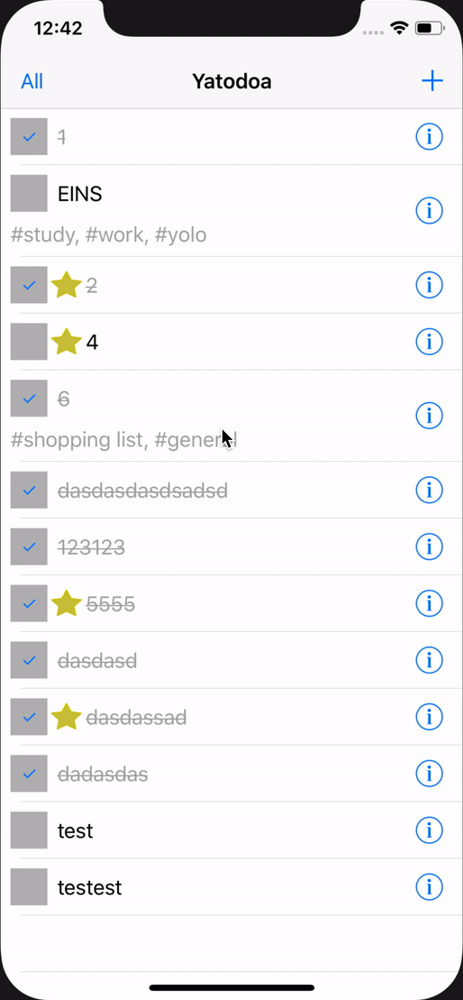

# Assignment 08

In diesem Assignment sollen `NSPredicate` und `UserDefaults` geübt werden

## Filter für *Alle* und *Offene* Todos

Todos können nach *allen* oder nur *offenen* Todos gefiltert werden

- `UIBarButtonItem`, welcher mit *allen* Todos anfängt (kein Filter) und beim Tap seine Semantik ändert
- `fetchedResultsController.fetchRequest.predicate` muss entsprechend angepasst werden
- **Wichtig**: anschließend müssen `fetchedResultsController.performFetch()`  und `tableView.reloadData()` aufgerufen werden

## Persistieren der Filtereinstellung mit UserDefaults

Die Filtereinstellung aus dem ersten Teil soll in `UserDefaults` gespeichert werden, damit die Einstellung beim nächsten Start der App nicht verloren geht

- Wenn ein Filter existiert, dann soll dieser verwendet werden
- Wenn kein Filter exisitiert, soll *All* verwendet werden (Fallback)

Die Persistenz von UserDefaults wird getestet, indem das Projekt in Xcode neu gebaut wird